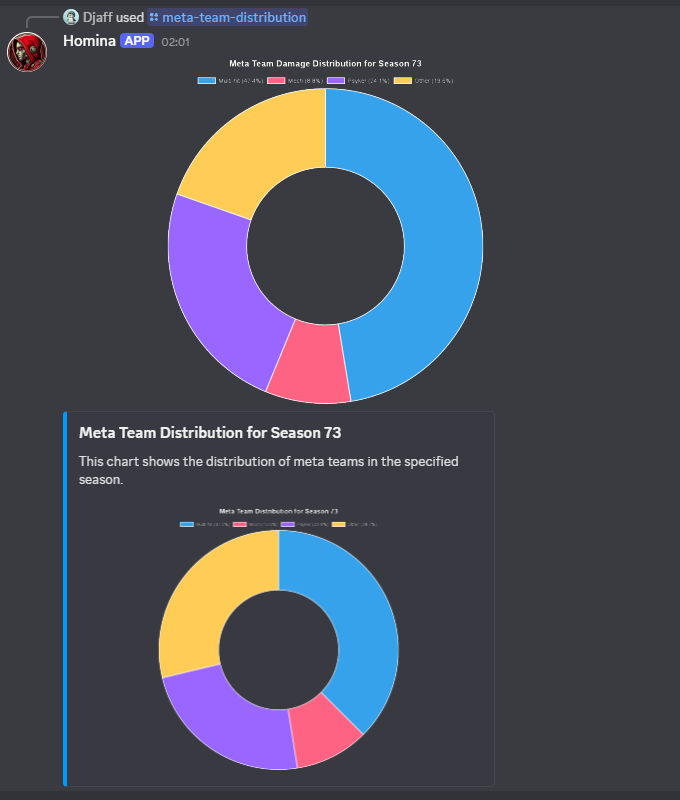

# homina

**_Homina-homina-homina_**

Blessed is the Machine Spirit.

This is a simple Discord bot in early access, intended to provide guilds with useful information regarding its members, guild, and guild raid information. It will be updated as Snowprint updates their public API.

---

## Stack

-   Discord integration handled by [discord.js](https://discord.js.org/docs/packages/discord.js/14.18.0)
-   Built using [Bun](https://bun.sh/)
-   Data Visualization through [Chart.js](https://www.chartjs.org/) and [chartjs-node-canvas](https://github.com/SeanSobey/ChartjsNodeCanvas)

---

## Prerequisites

Before running the project, ensure you have the following installed:

-   [Node.js](https://nodejs.org/) and [Bun](https://bun.sh/) (latest version recommended)
-   [PostgreSQL](https://www.postgresql.org/) for database management
-   A Discord bot token (create one via the [Discord Developer Portal](https://discord.com/developers/applications))
-   Set your [environment variables](#environment-variables) and player mappings (see further down)
-   **Optional**: Nix (to use the provided flake for a reproducible dev shell/environment)

### Nix flake

> Nix is a powerful package manager for Linux and macOS, designed to provide a reliable and reproducible way to manage software dependencies. Nix allows you to create isolated environments and build systems, preventing dependency conflicts and ensuring consistent development and deployment environments.

If you are using Nix, you don't need to manually install anything.

You have two options for development:

1. Use nix direnv and create a .envrc in your root folder with the following:

```shell
use flake
```

2. Use the nix shell

```shell
nix develop
```

To update flake inputs:

```shell
nix flake update
```

## Environment Variables

Create a `.env` file in the root of the project and add the following variables:

-   BOT_TOKEN - Your discord's bot token
-   CLIENT_ID - (Your application's client id ([Discord Developer Portal](https://discord.com/developers/applications) -> General Information -> application id))
-   GUILD_ID - Your development server's id
-   DB_NAME - Name of your postgres database
-   DB_USER - Your postgres database username
-   DB_PWD - The password to your postgres database

```plaintext
BOT_TOKEN=your-bot-token
CLIENT_ID=your-client-id
GUILD_ID=your-guild-id
DB_NAME=your-database-name
DB_USER=your-database-user
DB_PWD=your-database-password (use " " if no password)
```

## Player mapping

The public Tacticus API provided by Snowprint does not, as of writing this, include the usernames of the user—only their id. Therefore we need to do some mapping on our own so that we can get pretty outputs for our guild data. This unfortunately also means that each guild must for the time being host their own discord bot. I am working on a solution where someone can upload a mapping config, but neither option is very pleasant. Hopefully Snowprint change their mind and add usernames to the guild data on members.

For now:

-   add the file `src/lib/player-mapping/player-mapping.json`.
    -   You should see a folder named `player-mapping/`with a `PLAYER-MAPPING-GOES-HERE.txt` file showing you where to place it. The txt file can be deleted.
-   Add the mappings in this format with your own data:
-   _I am sorry for how troublesome this is. I will try my best to make it easier._

```json
{
    "user-id-1": "username",
    "user-id-2": "username"
}
```

## Database Configuration

1. Ensure PostgreSQL is installed and running.
2. Create a database for the bot:
    ```bash
    createdb homina
    ```
3. Update the `.env` file with your database credentials (`DB_NAME`, `DB_USER`, `DB_PWD`).
4. Run the following command to create the necessary tables:
    ```bash
    bun run createTables
    ```

---

## Before running the bot

To install dependencies:

```bash
bun install
```

To create database tables:

```bash
bun run createTables
```

To deploy commands so that they're available in Discord:

```bash
bun run deployCommands
```

## Usage

To run the bot:

```bash
bun run dev
```

The bot checks the database connection before starting up, but if you want to test it without waiting for the bot you can use:

```bash
bun run testDb
```

---

## Features

The bot, as of writing this, comes with the following commands:

-   Register - Register your api token to your discord user id. This is stored in the database for lookups in the other commands.
-   Seasons - Returns the seasons that have stored data for your guild
-   Season participation - Returns a graph displaying the total damage done in guild raid and total tokens used for a given season
-   Season by tier - Returns graphs displaying the total damage done to specific guild bosses of the given season, tokens used and the mean damage per token
-   Meta team distribution - Calculates the distribution of the 3 main meta teams used in tacticus over a season and the distribution of damage dealt by the meta teams. Entries that don't fit into a meta team category is grouped as 'other'

## Contributing

Contributions are welcome! To contribute:

1. Fork the repository.
2. Create a new branch for your feature or bugfix:
    ```bash
    git checkout -b feature-name
    ```
3. Commit your changes:
    ```bash
    git commit -m "Add feature-name"
    ```
4. Push to your branch:
    ```bash
    git push origin feature-name
    ```
5. Open a pull request.

---

## License

This project is licensed under the MIT License. See the `LICENSE` file for details.

---

## Common Issues

### Database Connection Errors

-   Ensure PostgreSQL is running and the credentials in the `.env` file are correct.
-   Run the db test script: `bun run testDb`
-   Verify that the database exists by running:
    ```bash
    psql -l
    ```

### Missing Environment Variables

-   Double-check that all required variables are present in the `.env` file.

---

## Screenshots

Here’s an example of the bot in action:


## 

## Acknowledgments

-   Thanks to [Snowprint Studios](https://snowprintstudios.com/) for their public API.
-   Inspired by the community of Discord bot developers.
