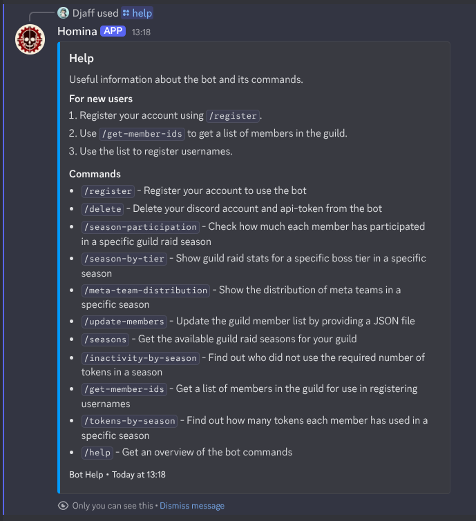
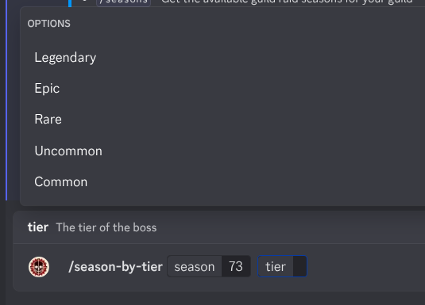
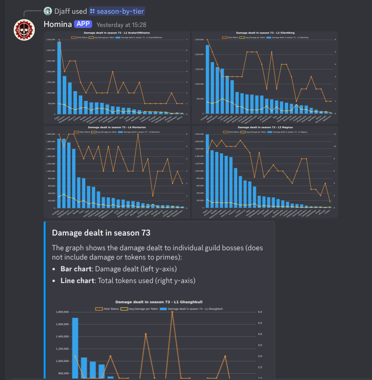
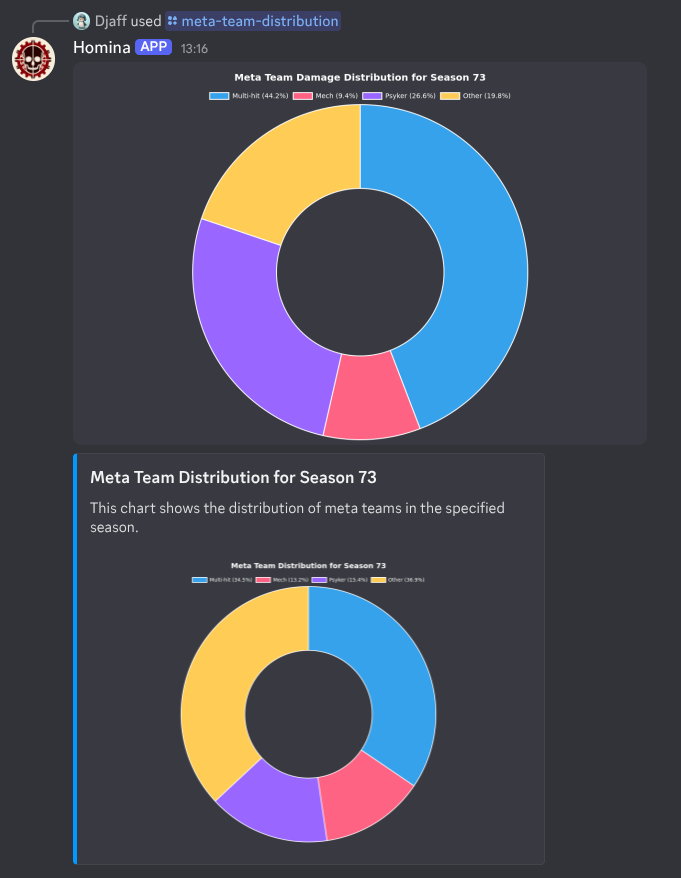
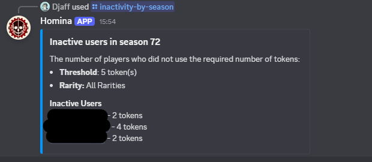

# homina

<div align="center">
    


</div>

**_Homina-homina-homina_**

Blessed is the Machine Spirit.

This is a simple Discord bot in early access, intended to provide guilds with useful information regarding its members, guild, and guild raid information. It will be updated as Snowprint updates their public API.

To invite the bot to your server, click [here](https://discord.com/oauth2/authorize?client_id=1351837170498801714)

The discord support server can be found [here](https://discord.gg/FajYxuWY9b)

## Table of Contents

<!-- TOC -->

-   [Features](#features)
-   [Stack](#stack)
-   [Prerequisites](#prerequisites)
-   [Environment Variables](#environment-variables)
-   [Player mapping](#player-mapping)
-   [Database Configuration](#database-configuration)
-   [Before running the bot](#before-running-the-bot)
-   [Usage](#usage)
-   [Contributing](#contributing)
-   [License](#license)
-   [Common Issues](#common-issues)
-   [Screenshots](#screenshots)
-   [Acknowledgments](#acknowledgments)
<!-- /TOC -->

## Features

-   Provides detailed guild member and raid information
-   Tracks and displays guild activity and participation
-   Generates visual charts for guild stats using Chart.js
-   Supports custom player mapping for accurate member names
-   Offers commands for exporting and updating member data
-   Integrates with PostgreSQL for persistent data storage
-   Easy setup with environment variables and secret management
-   Slash command support for modern Discord interaction
-   Regular updates as the Tacticus API evolves
-   Includes a help command and detailed usage instructions
-   Designed for extensibility and community contributions

This should be all the information you need if you just want to invite the bot to your server. Further information will be for those who want technical information about the bot.

---

## Stack

-   Discord integration handled by [discord.js](https://discord.js.org/docs/packages/discord.js/14.18.0)
-   Built using [Bun](https://bun.sh/)
-   Data Visualization through [Chart.js](https://www.chartjs.org/) and [chartjs-node-canvas](https://github.com/SeanSobey/ChartjsNodeCanvas)

---

## Prerequisites

Before running the project, ensure you have the following installed:

-   [Node.js](https://nodejs.org/) and [Bun](https://bun.sh/) (latest version recommended)
-   [PostgreSQL](https://www.postgresql.org/) for database management
-   A Discord bot token (create one via the [Discord Developer Portal](https://discord.com/developers/applications))
-   Set your [environment variables](#environment-variables) and player mappings (see further down)
-   Set up a secret manager using Infisical
-   **Optional**: Nix (to use the provided flake for a reproducible dev shell/environment)

### Nix flake

> Nix is a powerful package manager for Linux and macOS, designed to provide a reliable and reproducible way to manage software dependencies. Nix allows you to create isolated environments and build systems, preventing dependency conflicts and ensuring consistent development and deployment environments.

If you are using Nix, you don't need to manually install anything.

You have two options for development:

1. Use nix direnv and create a .envrc in your root folder with the following:

```shell
use flake
```

2. Use the nix shell

```shell
nix develop
```

To update flake inputs:

```shell
nix flake update
```

## Environment Variables

Create a `.env` file in the root of the project and add the following variables:

-   DB_NAME - Name of your postgres database
-   DB_USER - Your postgres database username
-   DB_PWD - The password to your postgres database
-   INFISICAL_SECRET - Your Infisical secret key
-   INFISICAL_ID - Your Infisical project ID
-   INFISICAL_WORKSPACE - Your Infisical workspace ID
-   NODE_ENV - The environment (either `dev` for development or `prod` for production)

```plaintext
DB_NAME=your-database-name
DB_USER=your-database-user
DB_PWD=your-database-password
INFISICAL_SECRET=your-infisical-secret
INFISICAL_ID=your-infisical-id
INFISICAL_WORKSPACE=your-infisical-workspace-id
NODE_ENV=dev|prod
```

## Player mapping

The public Tacticus API provided by Snowprint does not, as of writing this, include the usernames of the user—only their id. Therefore we need to do some mapping on our own so that we can get pretty outputs for our guild data. Hopefully Snowprint change their mind and add usernames to the guild data on members.

For now:

1.  Use the `/member-ids` command and save the JSON file to your device

This file contains the id of every member in your guild and a placeholder for their username. See the [example](#json-placeholder-example) below.

2. Open the game, click to the GUILDS tab, press your guild and find the Members list.

3. Replace the `replace-with-username` with the usernames of your guild members **in the order that they're displayed in the app** and save your changes. You can do this by simply opening the file you saved with any editor of your choice. NB! Make sure you don't have a comma after the last line.

4. Use the `/update-members` command and attach the file you saved.

### JSON Placeholder Example

```json
{
    "user-id-example-1": "replace-with-username",
    "user-id-example-2": "replace-with-username"
}
```

## Database Configuration

1. Ensure PostgreSQL is installed and running.
2. Create a database for the bot:
    ```bash
    createdb homina
    ```
3. Update the `.env` file with your database credentials (`DB_NAME`, `DB_USER`, `DB_PWD`).

---

## Before running the bot

To install dependencies:

```bash
bun install
```

To deploy commands so that they're available in Discord:

```bash
bun run deployCommands
```

## Usage

To run the bot:

```bash
bun run dev
```

The bot checks the database connection before starting up, but if you want to test it without waiting for the bot you can use:

```bash
bun run testDb
```

---

## Contributing

Contributions are welcome! To contribute:

1. Fork the repository.
2. Create a new branch for your feature or bugfix:
    ```bash
    git checkout -b feature-name
    ```
3. Commit your changes:
    ```bash
    git commit -m "Add feature-name"
    ```
4. Push to your branch:
    ```bash
    git push origin feature-name
    ```
5. Open a pull request.

---

## License

This project is licensed under the MIT License. See the `LICENSE` file for details.

---

## Common Issues

-   Updating your guild member mappings - Make sure the JSON is valid and that the last line in the object does not have a trailing comma. There are websites that validate your JSON if you're unsure.

---

## Screenshots

Here are some examples of the bot in action:

|                         |
| :-------------------------------------------------------: |
|                     The help command                      |
|  |
|             Features optional rarity options              |
|   |
|             Get detailed graphs for a rarity              |
|  |
| See how well your guild utilises the different meta teams |
|        |
|               Check who's not contributing                |

## Acknowledgments

-   Thanks to [Snowprint Studios](https://snowprintstudios.com/) for their public API.
-   Inspired by the community of Discord bot developers.
